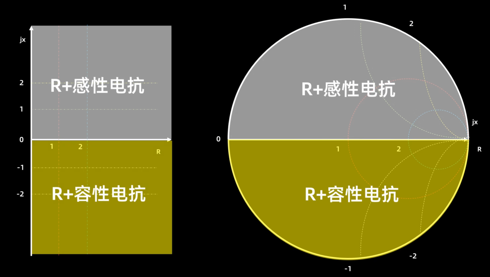
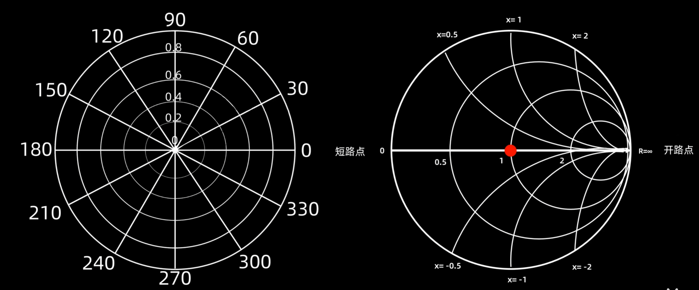
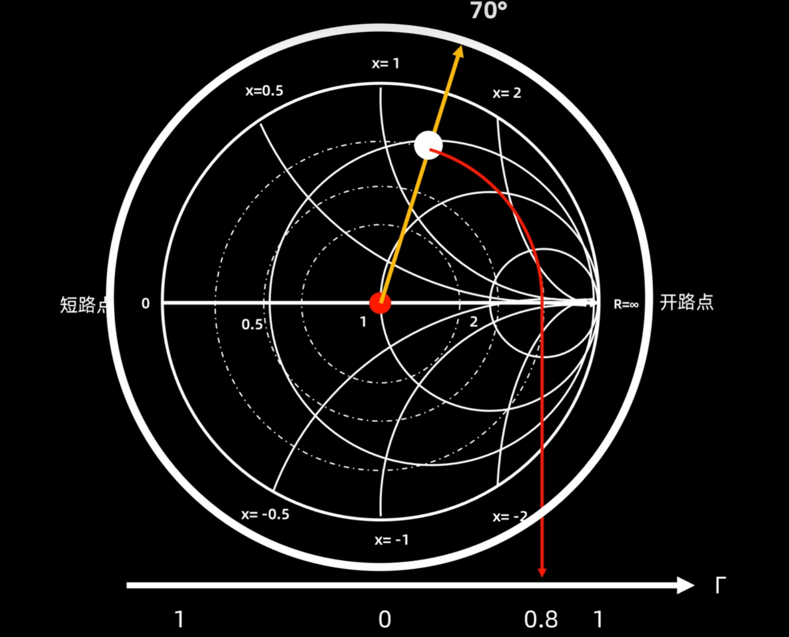

# 阻抗匹配

## 史密斯圆图

## TDR时域反射技术(2023年B题)
1. 信号发射：TDR 发射一个快速上升沿的脉冲信号（通常是高斯脉冲）
- 高斯脉冲：$$ f(t) = A e^{-\frac{(t - \mu)^2}{2\sigma^2}} $$
2. 信号传播：信号沿着传输路径（如 PCB 走线、电缆或连接器）传播。
3. 反射与叠加：当信号遇到阻抗不匹配的位置时，部分信号会被反射回来
- 传输线信号反射：反射系数$ \Gamma $ 
$$ \Gamma=\frac{Z_L-Z_S}{Z_L+Z_S} $$
4. 波形捕捉：TDR 捕捉到反射波形，并通过分析波形的时间和幅度信息，推断出传输路径的阻抗特性。

## PCB阻抗匹配
[嘉立创阻抗计算器](https://tools.jlc.com/jlcTools/index.html#/impedanceCalculatenew)

## 开源VNA
- [NanoVNA](https://github.com/ttrftech/NanoVNA)
- [NanoVNA-J](https://oshwhub.com/jimmylc/NanoVNA-J)
- [NanoVNA-H](https://oshwhub.com/bitshen/nanovna-s)
- [LibreVNA](https://gitcode.com/gh_mirrors/li/LibreVNA?utm_source=artical_gitcode&index=top&type=href&&isLogin=1)

## 高频备赛
- 电赛是否会用到阻抗匹配？似乎命题组在故意地压低频率？
- 命题组希望考核算法（如调制解调、滤波）和系统集成能力，而非高频电路调试（耗时且依赖经验）
- 避免自主设计高频电路（如功率放大器、混频器），优先选择模块化方案
